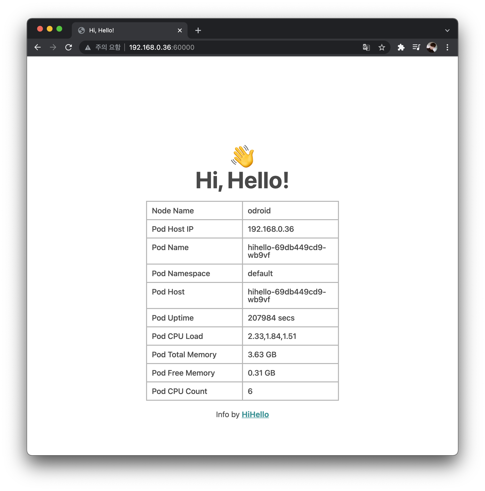

# HiHello

<center>
	
</center>

Docker or Kubernetes를 테스트하기 좋은 심플한 웹 서버

> 웹페이지의 디자인은 [여기](https://github.com/premist/inspekt) 소스코드를 사용했습니다.

## Badges

<!-- Badges -->
[](https://raw.githubusercontent.com/rhea-so/HiHello/main/LICENSE)
[](https://github.com/rhea-so/HiHello/issues)
[](https://github.com/rhea-so/HiHello/pulls)
[](https://github.com/rhea-so/HiHello)

## Usage

## Prepare

Kubernetes, Docker가 설치된 PC에서 실행해야 함

## Script

```sh
git clone https://github.com/rhea-so/HiHello
cd HiHello
./run.sh
```

위 명령어 실행시, HPA & Deployments & Service가 Kubernetes에 등록됨

## Configuration & Setup

### Project Cloning

```sh
git clone https://github.com/rhea-so/HiHello
cd HiHello
npm i
```

## Build 

```sh
tsc
```

## Test

```sh
npm test
```

### Get Test Coverage

```sh
npm run coverage
```

## Documentation

* [프로젝트 변경 사항](https://github.com/rhea-so/HiHello/blob/main/CHANGELOG.md)
* [프로젝트 발전 방향](https://github.com/rhea-so/HiHello/blob/main/ROADMAP.md)

## Contribute

부탁드립니다. 이 프로젝트는 여러분의 기여를 바라고 있습니다. 기여를 해주세요.  
기여를 하는 법은 크게 어렵지 않습니다!!

* [당장 기여하는 방법 알아보기](https://github.com/rhea-so/HiHello/blob/main/CONTRIBUTING.md)
* [기여 해주신 고마운 분들](https://github.com/rhea-so/HiHello/blob/main/CONTRIBUTORS.md)

## Questions

* GitHub - [open issue](https://github.com/rhea-so/HiHello/issues)
* Email - [jeonghyeon.rhea@gmail.com](mailto:jeonghyeon.rhea@gmail.com?subject=[GitHub]%20Project%20Moon%20Community-Question)

### License

[GPL-3.0 License](https://github.com/rhea-so/HiHello/blob/main/LICENSE)
